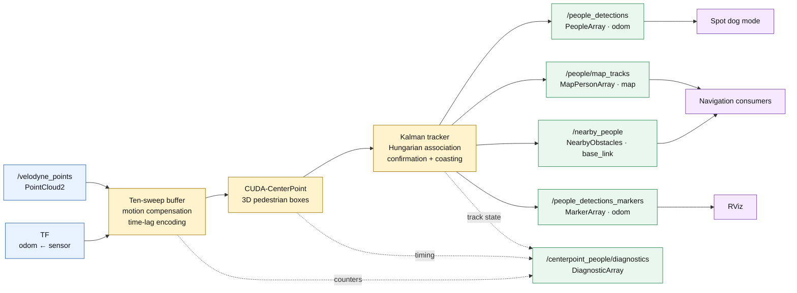
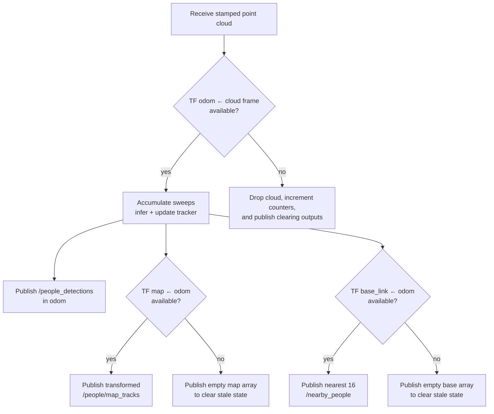

# CUDA-CenterPoint Pedestrian Tracking

`people_detector` owns the default LiDAR pedestrian detection and tracking
pipeline. It replaces separate detector, cluster, and tracker processes with
one CUDA-CenterPoint node that preserves 3D boxes and publishes stable tracks
for navigation, visualization, and dog mode.

## System dataflow



## Pipeline behavior

For each VLP-16 cloud, `centerpoint_people_node`:

1. Looks up the LiDAR pose in `odom`.
2. Accumulates ten sweeps and compensates robot motion using TF.
3. Encodes each point as `x, y, z, intensity, time_lag`, keeping newest points
   first if the 300,000-point limit is reached.
4. Runs the sparse-convolution and TensorRT CenterPoint models.
5. Preserves each pedestrian box's score, position, dimensions, yaw, and
   predicted velocity.
6. Transforms detections into `odom`.
7. Associates detections globally with a constant-velocity Kalman tracker.
8. Publishes only confirmed tracks, while coasting them through bounded short
   occlusions.

Backward timestamps and large input gaps reset the sweep buffer and tracker.
Track IDs remain stable across normal association, but are not persisted
across a reset or node restart.

## Interfaces

| Topic | Type | Frame | Contents |
|---|---|---|---|
| `/people_detections` | `people_detector/msg/PeopleArray` | `odom` | Stable ID, `source="centerpoint"`, confidence, 3D position/size, filtered velocity |
| `/people/map_tracks` | `people_detector/msg/MapPersonArray` | `map` | Map-frame state and rotated position/velocity covariance |
| `/nearby_people` | `bva_msgs/msg/NearbyObstacles` | `base_link` | Nearest 16 people with velocity expressed in base-frame axes |
| `/people_detections_markers` | `visualization_msgs/msg/MarkerArray` | `odom` | Stable-ID boxes, velocity arrows, and labels |
| `/centerpoint_people/diagnostics` | `diagnostic_msgs/msg/DiagnosticArray` | — | Sweep, point, detection, track, latency, TF, drop, and reset counters |

`/people_detections` is the primary consumer contract. Dog mode consumes it
directly, while navigation can use `/people/map_tracks` or `/nearby_people`.

If `map <- odom` is unavailable, the node immediately publishes an empty
map-frame array so consumers clear stale state. It does the same for
`/nearby_people` when `base_link <- odom` is unavailable. A missing transform
from the cloud frame into the tracking frame is different: that cloud cannot
be tracked, so the node drops it and clears all outputs.



## Requirements

- Jetson Orin with the NVIDIA container runtime.
- CUDA and TensorRT development/runtime libraries supplied by JetPack.
- ROS 2 Humble.
- Point clouds on `/velodyne_points` by default.
- Continuous TF from the point-cloud frame into `odom`.
- Optional `map <- odom` and `base_link <- odom` transforms for their
  respective downstream outputs.

TensorRT plans are machine- and runtime-specific. Do not copy a plan from
another Jetson or commit it to Git.

## First-time setup

Initialize the pinned CUDA-CenterPoint source and build the project image on
the host:

```bash
cd /home/ros/dance_ws_pedestrian_tracking
git submodule update --init --recursive src/Lidar_AI_Solution
./container build
```

On success, `./container build` starts the new container. Enter it with:

```bash
./container shell
```

All ROS commands must be run inside the project container. The normal
workspace mount is `/nav_ws`; on installations that retain the host path, use
`/home/ros/dance_ws_pedestrian_tracking` instead.

Inside the container:

```bash
cd /nav_ws
source /opt/ros/humble/setup.bash

./scripts/generate_centerpoint_engine.sh
colcon build --packages-up-to people_detector --symlink-install
source install/setup.bash
```

The engine script:

- detects the installed TensorRT version;
- builds a version-tagged plan under `.navws_runtime/centerpoint/`;
- verifies that TensorRT can deserialize it; and
- creates the relative compatibility symlink
  `.navws_runtime/centerpoint/rpn_centerhead_sim.plan`.

Run the script again after changing JetPack, TensorRT, the CenterPoint model,
or the deployment Jetson.

## Launching

Start the Velodyne and odometry/TF sources first, then launch CenterPoint:

```bash
source /opt/ros/humble/setup.bash
source /nav_ws/install/setup.bash
ros2 launch people_detector pedestrian_tracking.launch.py
```

The launch defaults to:

- input `/velodyne_points`;
- tracking frame `odom`;
- map frame `map`;
- robot frame `base_link`;
- ten sweeps;
- three hits to confirm a track; and
- six missed frames of bounded coasting.

To override a launch-exposed setting:

```bash
ros2 launch people_detector pedestrian_tracking.launch.py \
  points_topic:=/velodyne_points \
  tracking_frame:=odom \
  score_threshold:=0.55 \
  confirm_hits:=3
```

List every launch argument with:

```bash
ros2 launch people_detector pedestrian_tracking.launch.py --show-args
```

Use `tmux/pedestrian_tracking` for a standalone live visualization session:

```bash
cd /nav_ws/tmux/pedestrian_tracking
tmuxinator local
```

The navstack, auto-dog-mode, human-feedback, and VLM dependency sessions
already launch CenterPoint. Do not start another instance when using one of
those sessions, because duplicate publishers would contend for the canonical
topics and GPU.

For a stationary detector dry run without Spot:

```bash
cd /nav_ws/tmux/auto_dog_mode_standalone
tmuxinator local
```

That session publishes a static identity `odom -> velodyne` transform. It is
only appropriate while the sensor is stationary; live robot motion requires
real odometry.

## Configuration and tuning

Defaults are in
`src/people_detector/config/centerpoint_people.yaml`. Launch arguments
override the corresponding YAML values.

| Parameter | Default | Effect |
|---|---:|---|
| `sweep_count` | `10` | Motion-compensated temporal accumulation |
| `reset_gap_sec` | `1.0` s | Timestamp gap that resets tracking |
| `score_threshold` | `0.5` | Minimum score for spawning a track |
| `maintain_score_threshold` | `0.3` | Lower threshold for maintaining an existing track |
| `association_gate_m` | `1.5` m | Maximum Euclidean association distance |
| `mahalanobis_gate` | `9.21` | Covariance-aware association threshold |
| `association_velocity_weight` | `0.5` | Velocity consistency contribution |
| `confirm_hits` | `3` | Consecutive associations before publication |
| `max_coast_frames` | `6` | Missed frames retained before expiration |
| `max_obstacles` | `16` | Maximum nearest people on `/nearby_people` |
| `tf_timeout_sec` | `0.05` s | Required tracking-transform timeout |

Raise `score_threshold` or `confirm_hits` to suppress short false positives.
Lowering them improves responsiveness but can create ghosts. Adjust
`maintain_score_threshold` separately so a marginal observation can preserve
an established track without spawning a new one.

Tracker noise, gating, thresholds, and coasting should be tuned from recorded
bags before live validation. Avoid changing multiple association parameters
at once.

PTv3 and ZED bridges remain explicit alternatives. Never run an alternative
publisher concurrently with CenterPoint on a canonical output topic.

## Verification

Confirm input and output rates:

```bash
ros2 topic hz /velodyne_points
ros2 topic hz /people_detections
```

Inspect the output contracts:

```bash
ros2 topic echo /people_detections --once
ros2 topic echo /people/map_tracks --once
ros2 topic echo /nearby_people --once
ros2 topic echo /centerpoint_people/diagnostics --once
```

Confirm their types:

```bash
ros2 topic list -t | grep -E \
  'people_detections|people/map_tracks|nearby_people|centerpoint_people/diagnostics'
```

RViz configurations subscribe to `/people_detections_markers`. A confirmed
person should appear as a stable-ID box with a velocity arrow and text label.

Diagnostics include:

| Key | Meaning |
|---|---|
| `sweep_count` | Sweeps currently accumulated |
| `input_points` | Valid points in the newest cloud |
| `packed_points` | Points sent to CenterPoint |
| `detections` | Pedestrian boxes surviving the score threshold |
| `confirmed_tracks` | Tracks currently published |
| `inference_ms` | GPU inference duration |
| `callback_ms` | End-to-end cloud callback duration |
| `missing_tf_frames` | Missing required or optional output transforms |
| `dropped_frames` | Input clouds that could not be processed |
| `reset_frames` | Timestamp/gap resets |
| `frames_received` | Point clouds received by the node |

At startup, `sweep_count` ramps from 1 to 10. Unconfirmed detections can make
`detections` nonzero while `confirmed_tracks` remains zero for the first few
frames.

## Troubleshooting

### Missing or incompatible TensorRT plan

Run inside the Jetson container:

```bash
cd /nav_ws
./scripts/generate_centerpoint_engine.sh
```

Startup intentionally rejects a missing plan, a plan tagged for a different
TensorRT major version, a missing sparse-convolution model, or an unavailable
CUDA device.

### No `/people_detections`

Check that `/velodyne_points` is active and inspect the diagnostic topic. Then
verify that TF can connect `odom` to the frame in the cloud header. Without
that tracking transform, the node publishes clearing messages but cannot run
association.

### Empty map or nearby outputs

Check the `map <- odom` and `base_link <- odom` TF chains. These transforms are
optional for tracking itself, so `/people_detections` may remain healthy while
one downstream array is empty.

### Detections but no confirmed tracks

Wait for the ten-sweep warm-up and the default three-hit confirmation window.
Then inspect `score_threshold`, `maintain_score_threshold`, TF stability, and
timestamp continuity.

### Low output rate or high latency

Ensure only one CenterPoint node is running, no input backlog is accumulating,
and the container has NVIDIA runtime access. Use `inference_ms`,
`callback_ms`, and `frames_received` to distinguish GPU time from ROS/TF
overhead.
