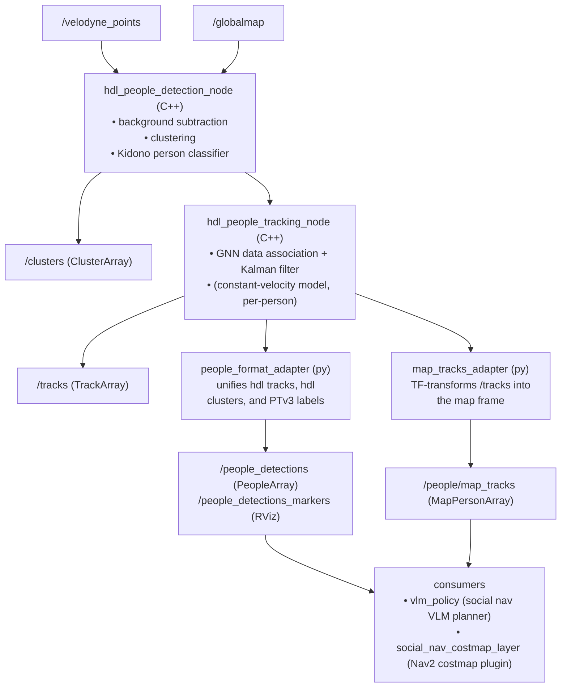

# Pedestrian Tracking Pipeline

How the Spot payload detects and tracks people from the VLP-16 lidar, and how to run and debug the pipeline.

## 1. Overview

The pipeline is three stages, each a separate node (or pair of nodes):



Key packages:

| Package | Language | Role |
|---|---|---|
| `src/hdl_people_tracking/hdl_people_tracking` | C++ | Detection + tracking (port of [koide3/hdl_people_tracking](https://github.com/koide3/hdl_people_tracking) to ROS 2 composable nodes) |
| `src/hdl_people_tracking/hdl_people_tracking_msgs` | msgs | `Cluster[Array]`, `Track[Array]` |
| `src/people_detector` | Python | Format/frame adapters + unified `People*` / `MapPerson*` messages |

## 2. How each stage works

### 2.1 Detection — `hdl_people_detection_node`

Source: `src/hdl_people_tracking/hdl_people_tracking/apps/hdl_people_detection_nodelet.cpp`

1. **Inputs**: `velodyne_points` (remapped to `/velodyne_points`) and `globalmap`
   (`PointCloud2`, QoS transient-local, depth 1). Detection does not start until a
   `globalmap` has arrived.
2. **Background subtraction**: the global map is voxelized
   (`backsub_resolution`, default 0.2 m) into an occupancy structure; incoming scan
   points that fall into occupied voxels (threshold `backsub_occupancy_thresh`) are
   discarded. Whatever survives is "not part of the static world".
3. **Clustering** (Haselich technique): Euclidean clustering with
   `cluster_tolerance` 0.4 m, gated by point count (`cluster_min_pts`=10,
   `cluster_max_pts`=8192) and bounding-box size (roughly human-sized:
   0.2–1.0 m in x/y, 1.0–2.5 m in z).
4. **Classification**: Kidono's boosted person classifier
   (`data/boost_kidono.model` + `.scale`) sets `is_human` on each cluster
   (`enable_classification: true`).
5. **Output**: `/clusters` (`ClusterArray`) in `tracking_frame`.

The detector's point-cloud debug topics form a strict subset chain:
`/human_points` contains only clusters with `is_human=true`, `/cluster_points`
contains every size-gated cluster, and `/backsub_points` contains the complete
background-subtracted residual. Therefore
`/human_points ⊆ /cluster_points ⊆ /backsub_points`.

**Frame contract**: `tracking_frame` (param, default `odom`) **must equal the
`globalmap` header frame**, otherwise the node logs an error and rejects the map
(`hdl_people_detection_nodelet.cpp:208`). The scan is TF-transformed from the
lidar frame into `tracking_frame` before background subtraction.

**The globalmap source**: the stock launch files run a *dummy* map publisher
(`scripts/dummy_map_publisher.py` — a single point at the origin, frame `odom`;
`dummy_map_publisher_map.py` is the `map`-frame variant). With a dummy map,
background subtraction is a no-op and *everything* becomes a candidate cluster —
the size gates and the classifier then do all the filtering. To actually
subtract the building, publish your real 3D map point cloud (e.g. an exported
LiORF/LIO-SAM map) on `globalmap` with transient-local QoS in the tracking
frame instead.

### 2.2 Tracking — `hdl_people_tracking_node`

Source: `apps/hdl_people_tracking_nodelet.cpp`,
`include/hdl_people_tracking/people_tracker.hpp`, `kalman_tracker.hpp`,
`include/kkl/alg/*`.

- Takes `is_human` clusters from `/clusters`.
- **Data association**: global nearest neighbor (Munkres/Hungarian assignment,
  `kkl/alg/global_nearest_neighbor_association.hpp`) matching clusters to
  existing tracks; `human_radius` (0.4 m) bounds the gate.
- **Filtering**: one Kalman filter per person with a constant-velocity model.
  Tracks that go unobserved accumulate covariance and are removed once the
  position trace exceeds `remove_trace_thresh` (1.0).
- **Output**: `/tracks` (`TrackArray`). Each `Track` carries:
  `id` (stable across frames), `age` (seconds), `pos`, `vel`, `pos_cov[9]`,
  `vel_cov[9]`, and `associated` clusters (used downstream for bounding-box size).

### 2.3 Adapters — `people_detector`

**`people_format_adapter_node.py`** ([launch](../src/people_detector/launch/people_format_adapter.launch.py))
merges up to three sources into one `PeopleArray` on `/people_detections`:

| Source | Input topic | ID stability | Velocity | Confidence |
|---|---|---|---|---|
| `hdl_tracks` | `/tracks` | stable | yes (KF) | 1.0 |
| `hdl_clusters` | `/clusters` | per-frame index | no | 1.0 human / 0.2 other |
| `ptv3_labels` | `/pointcept/labels` + `/velodyne_points` | **new ID every frame** | no | 1.0 |

The PTv3 path takes per-point semantic labels (Point Transformer v3 /
Pointcept, person label = 1 by default), matches the label array back to a
buffered point cloud **by point count** (exact match preferred, near-match
within `ptv3_match_count_tolerance`=32 points accepted), masks person points,
z-gates them (−1.0…2.5 m), and runs a grid-hash Euclidean clustering
(`ptv3_cluster_tolerance` 0.6 m, ≥20 points per cluster).

It also publishes RViz markers on `/people_detections_markers`:
sphere + text label per person, color-coded — **green** = hdl_tracks,
**orange** = hdl_clusters, **blue** = ptv3_labels.

**`map_tracks_adapter_node.py`** ([launch](../src/people_detector/launch/map_tracks_adapter.launch.py))
converts `/tracks` into `MapPersonArray` on `/people/map_tracks`, in the `map`
frame (param `target_frame`). It looks up TF `map ← odom` at the message stamp
(`transform_timeout_sec` 0.05 s), rotates position/velocity, rotates both
covariances properly (R·Σ·Rᵀ), and adds timing metadata: `sample_time_sec`,
`track_age_sec`, and per-track `dt_sec` since that ID was last seen. This is
the topic planners should use — positions stay consistent while the robot
drives, since AMCL owns `map → odom`.

### 2.4 Message reference

- `hdl_people_tracking_msgs/Track`: `id, age, pos, vel, pos_cov[9], vel_cov[9], associated[], `
- `hdl_people_tracking_msgs/Cluster`: `is_human, min_pt, max_pt, size, centroid`
- `people_detector/People`: `id, source, label, confidence, is_human, position, velocity, size`
- `people_detector/MapPerson`: `id, source, confidence, sample_time_sec, track_age_sec, dt_sec, position, velocity, size, position_covariance[9], velocity_covariance[9]`

Note both `hdl_people_tracking_msgs` and a legacy `hdl_people_tracking/msg`
variant of the messages exist; the adapters subscribe to both types on the same
topic and use whichever arrives.

## 3. Running it

Everything runs inside the container (`./container shell`, or
`docker exec nav_ws /bin/bash -lc '...'` for one-offs).

### 3.1 Build

```bash
colcon build --symlink-install --packages-select \
  hdl_people_tracking_msgs hdl_people_tracking people_detector
source install/setup.bash
```

### 3.2 Full session via tmuxinator

```bash
tmuxinator start hdl_people_tracking   # from ~/nav_ws
```

This launches (see `tmux/hdl_people_tracking/.tmuxinator.yaml`): the Azure
Kinect driver, `hdl_people_tracking.launch.py`, the Velodyne driver
(`spot_velodyne`), a VNC server, and RViz (`rviz2/navstack.rviz`) on `DISPLAY=:9`.

### 3.3 Manual, piece by piece

```bash
# 1. Lidar
ros2 launch spot_velodyne velodyne.launch.py

# 2. Detection + tracking (odom frame, dummy globalmap)
ros2 launch hdl_people_tracking hdl_people_tracking.launch.py
#    …or in the map frame (requires map→odom TF, i.e. AMCL/nav stack running):
ros2 launch hdl_people_tracking hdl_people_tracking_map.launch.py

# 3. Unified detections + RViz markers
ros2 launch people_detector people_format_adapter.launch.py

# 4. Map-frame tracks for planners (requires map→odom TF)
ros2 launch people_detector map_tracks_adapter.launch.py
```

Useful launch arguments:

- `hdl_people_tracking.launch.py`: `static_sensor:=true` if the lidar is not
  moving (skips odometry compensation).
- `hdl_people_tracking_map.launch.py`: `tracking_frame:=map` (default) and runs
  `dummy_map_publisher_map.py` instead of the odom-frame one.
- `people_format_adapter.launch.py`: `enable_hdl_tracks / enable_hdl_clusters /
  enable_ptv3` to toggle sources; `include_non_human_clusters:=true` to also
  pass low-confidence clusters.
- `map_tracks_adapter.launch.py`: `target_frame`, `tracks_topic`, `output_topic`.

### 3.4 Verifying it works

```bash
ros2 topic hz /velodyne_points          # lidar up (~10 Hz)
ros2 topic echo /clusters --once        # detections flowing, check is_human
ros2 topic echo /tracks --once          # stable ids, non-zero vel when walking
ros2 topic echo /people_detections --once
ros2 topic echo /people/map_tracks --once   # needs map→odom TF
ros2 run tf2_ros tf2_echo map odom          # sanity-check localization
```

In RViz add `MarkerArray` on `/people_detections_markers` — walk in front of
the robot and you should see a green sphere with `id=N src=hdl_tracks`
following you, with the id staying constant.

## 4. Tuning knobs

Detection (`hdl_people_tracking.launch.py`, inline params):

| Param | Default | Effect |
|---|---|---|
| `backsub_resolution` / `backsub_occupancy_thresh` | 0.2 / 2 | Background-subtraction voxel size / hit threshold |
| `cluster_tolerance` | 0.4 | Cluster merge distance — raise if a person splits into two clusters |
| `cluster_min/max_pts` | 10 / 8192 | Point-count gate — lower `min_pts` for far-away people |
| `cluster_*_size_*` | 0.2–1.0 (xy), 1.0–2.5 (z) | Human-sized bounding-box gate — lower `min_size_z` to catch children/sitting people |
| `enable_classification` | true | Disable to treat every size-gated cluster as human |

Tracking: `human_radius` (0.4, association gate), `remove_trace_thresh`
(1.0, higher = tracks survive longer occlusions).

PTv3 path: `ptv3_person_label`, `ptv3_cluster_tolerance`, `ptv3_min_cluster_points`,
`ptv3_min_z`/`max_z`, `ptv3_point_buffer_size`, `ptv3_match_count_tolerance`.

## 5. Troubleshooting

- **No `/clusters` at all** → detector never got a `globalmap`, or the map
  frame ≠ `tracking_frame`. Look for
  `globalmap frame '…' != tracking_frame '…'` or
  `globalmap has not been received!!` in the container logs. The dummy map
  publisher is one-shot but transient-local, so late joiners still receive it —
  if you restarted only the *publisher*, restart the detector too.
- **Clusters but nothing `is_human`** → the size gates or Kidono classifier are
  rejecting them. Try `include_non_human_clusters:=true` on the format adapter
  to visualize what's being rejected, then loosen `cluster_*_size_*` or set
  `enable_classification:=false` to isolate which stage drops them.
- **`/people/map_tracks` empty, warning `TF unavailable for /tracks`** → no
  `map → odom` transform; start localization (nav stack / AMCL) or set
  `target_frame:=odom`.
- **PTv3 warnings about labels/points length mismatch** → the label array
  doesn't match any buffered cloud within tolerance; check that
  `ptv3_points_topic` is the same cloud the segmentation node consumed, or
  raise `ptv3_point_buffer_size` / `ptv3_match_count_tolerance`.
- **Track ids jumping** → association gate too tight for fast walkers: raise
  `human_radius`; or detections are flickering (fix detection gates first).
- **Ghost detections on furniture/walls** → you're running with the dummy
  globalmap, so nothing is background-subtracted. Publish the real map cloud on
  `globalmap` (transient-local, in `tracking_frame`).
- Remember the PTv3 source assigns a **fresh id every frame**
  (`_ptv3_id_counter`); only `hdl_tracks` ids are stable. Don't key persistent
  state off `/people_detections` ids unless `source == "hdl_tracks"`.
