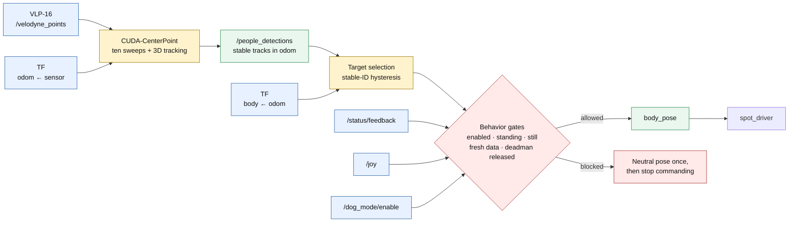
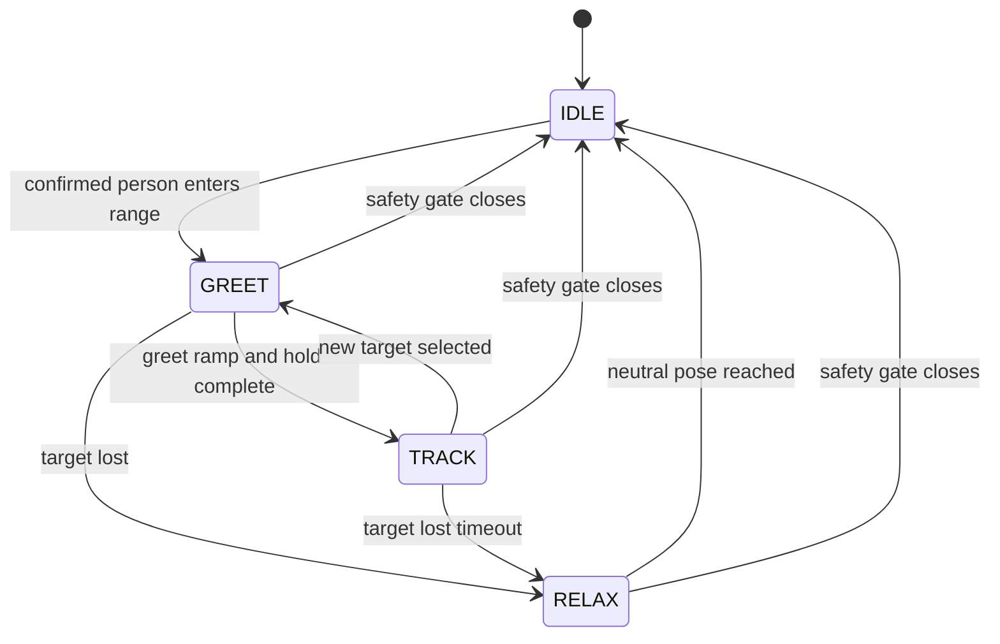

# Spot Dog Mode with CenterPoint

`spot_dog_mode` makes Spot greet and gaze-track nearby people. The behavior
consumes the stable tracks published by the canonical CUDA-CenterPoint LiDAR
pipeline:



CenterPoint accumulates ten motion-compensated LiDAR sweeps, detects 3D
pedestrian boxes, and tracks them in `odom` with stable IDs and filtered
velocities. Dog mode transforms each published position from `odom` into
Spot's `body` frame before selecting a gaze target.

See [`../../docs/pedestrian_tracking.md`](../../docs/pedestrian_tracking.md)
for detector setup, engine generation, interfaces, and tuning.

## Requirements

Before starting dog mode:

- Run on the Jetson Orin container with CUDA and TensorRT available.
- Generate the CenterPoint TensorRT engine at least once.
- Publish `sensor_msgs/msg/PointCloud2` on `/velodyne_points`.
- Provide TF from the point-cloud frame to `odom`, and from `odom` to `body`.
- Run the Spot driver and teleop/status publishers for live robot operation.

The gaze controller intentionally stops commanding when Spot is not standing,
Spot is moving, the manual deadman is held, dog mode is disabled, detections
become stale, or the required TF is unavailable.

## Recommended live demo

The `auto_dog_mode` tmux session launches the Spot driver, Velodyne,
CenterPoint, dog mode, teleop, camera, and RViz exactly once:

```bash
cd /nav_ws/tmux/auto_dog_mode
tmuxinator local
```

The RViz pane loads `rviz2/auto_dog_mode.rviz`, centered on Spot's `body`
frame with the robot model, Velodyne cloud, CenterPoint track markers, TF/body
axes, and Kinect RGB view.

Do not separately launch `pedestrian_tracking.launch.py` when using this
session.

Enable or disable the behavior with the service:

```bash
ros2 service call /dog_mode/enable std_srvs/srv/SetBool "{data: true}"
ros2 service call /dog_mode/enable std_srvs/srv/SetBool "{data: false}"
```

The PS4 Circle-button integration may also toggle the behavior when the normal
teleop stack is running. The latched `/dog_mode/enabled` topic reports its
current state.

## Manual launch

If CenterPoint is already running elsewhere, start only the gaze controller:

```bash
ros2 launch spot_dog_mode dog_mode.launch.py
```

For a minimal composition, dog mode can include CenterPoint:

```bash
ros2 launch spot_dog_mode dog_mode.launch.py include_tracking:=true
```

`include_tracking:=true` starts only the detector/tracker in addition to the
gaze controller. It does not start the Velodyne driver, Spot driver, or an
odometry/TF source.

For a detector-only dry run without Spot powered on:

```bash
cd /nav_ws/tmux/auto_dog_mode_standalone
tmuxinator local
```

That session supplies a static `odom -> velodyne` transform for a stationary
test and opens the pedestrian-tracking RViz configuration. It does not run the
dog-mode controller or command Spot.

## Runtime behavior

The gaze controller:

1. Receives confirmed `PeopleArray` tracks on `/people_detections`.
2. Transforms their 3D positions from the message frame into `body`.
3. Keeps the current stable ID unless another person is clearly closer.
4. Performs a short greet motion for a new target.
5. Smoothly tracks the estimated head position.
6. Holds briefly through a short occlusion, then relaxes to neutral.



The default attention radius is 4 m. If CenterPoint reports a useful 3D box
height, dog mode aims toward the top of the box; otherwise it uses the
configured fallback person height.

Behavior parameters are in `config/params.yaml`. Important settings include:

| Parameter | Default | Purpose |
|---|---:|---|
| `attention_radius` | `4.0` m | Maximum target distance |
| `target_switch_margin` | `0.75` m | Required advantage before changing targets |
| `target_lost_timeout` | `1.5` s | Occlusion time before relaxing |
| `detection_timeout` | `1.0` s | Maximum age of the detection stream |
| `greet_ramp` / `greet_hold` | `0.5` / `1.2` s | Greeting timing |
| `smoothing_tau` | `0.3` s | Tracking-pose smoothing |
| `max_rate_rad_s` | `1.0` rad/s | Body-pose slew limit |
| `deadman_button` | `4` | Manual-control override button |

Detector and tracker parameters are configured separately in
`people_detector/config/centerpoint_people.yaml`.

## Verification

Run these commands inside the project container:

```bash
ros2 topic hz /velodyne_points
ros2 topic hz /people_detections
ros2 topic echo /centerpoint_people/diagnostics --once
ros2 topic echo /dog_mode/enabled --once
ros2 topic echo /status/feedback --once
```

RViz should display stable-ID boxes, velocity arrows, and labels from
`/people_detections_markers`.

If CenterPoint publishes tracks but Spot does not react, check:

- Dog mode is enabled.
- `/status/feedback` reports `standing: true` and `moving: false`.
- The manual deadman is not held.
- TF can transform `odom` into `body`.
- `/people_detections` is fresh and contains a person within the attention
  radius.
