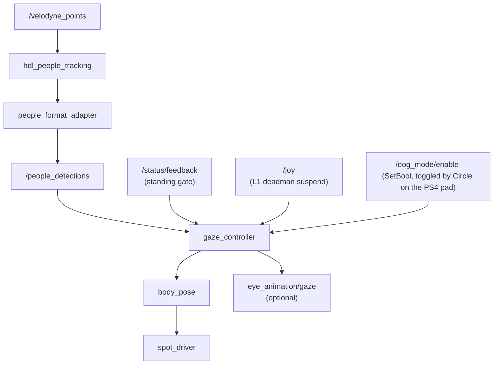

# spot_dog_mode

Spot perceives nearby people via LiDAR and responds with a friendly, dog-like "look-up" gesture.

## How it works



The gaze controller runs a small state machine:

- **IDLE** — nobody in `attention_radius`.
- **GREET** — a person newly enters range: ramp to yaw-toward-person plus an exaggerated look-up (`greet_pitch_boost`), hold briefly.
- **TRACK** — smooth, rate-limited gaze tracking of the target.
- **RELAX** — target left: ease back to neutral.

It only commands the body while Spot is **standing and not moving**, dog mode is enabled, detections are fresh, and the teleop manual deadman (L1) is not held. Disabling (or any gate dropping) publishes one neutral pose and stops.

## Usage

```bash
# Full demo stack:
cd tmux/auto_dog_mode && tmuxinator local

# Just this package (expects spot_driver + velodyne + hdl running):
ros2 launch spot_dog_mode dog_mode.launch.py            # adapter + controller
ros2 launch spot_dog_mode dog_mode.launch.py include_hdl:=true

# Toggle:
ros2 service call /dog_mode/enable std_srvs/srv/SetBool "{data: true}"
# or press Circle on the PS4 controller.
```

All tuning lives in `config/params.yaml`. 
Notable knobs: 
- `attention_radius`
- `greet_*` 
- `smoothing_tau`
- `pitch_sign` (flip if the robot bows instead of looking up)
- `publish_eye_gaze` (drive the eye display at the same target)